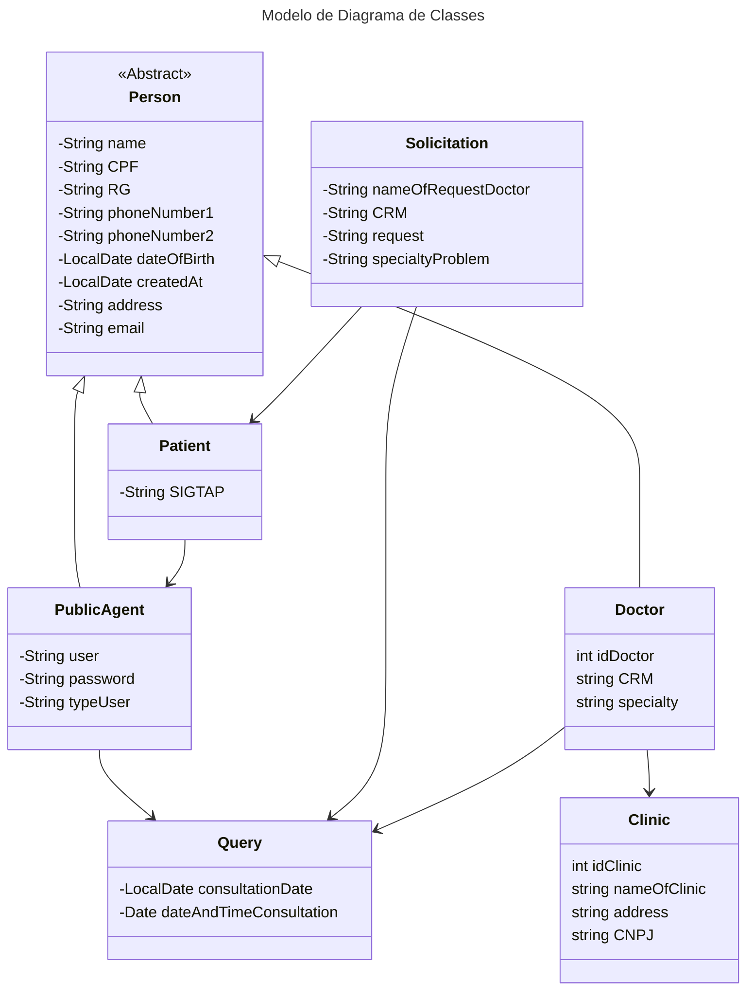

<<<<<<< HEAD
# **Agenda Dendê**

O projeto agenda Dendê se trata de um de aplicativo de marcação e gerenciamento de consultas voltado para a área da saúde, em resumo é um recurso que facilita o agendamento de consultas médicas operado principalmente pelos agentes de saúde, tornando a tarefa de agendar consultas muito mais simples, dinâmica e menos burocrática, tanto para os operadores, quanto para a população. Este projeto está sendo desenvolvido em virtude de avaliação na disciplina de Linguagem de programação II, sendo orientado pela professora Ana Cristina, do curso Bacharelado em Sistema de Informações.


## Minimundo e Fluxo de uso

### Motivação

Diversas cidades em todo o Brasil, trabalham incessantemente para prestar o melhor serviço de marcação de consultas, entretanto é notório que grande parte do processo é realizado por meio físico gerando diversos problemas como a dificuldade de organizar as informações do paciente, além da lentidão do processo uma vez que as informações são gravadas em papel e passadas por diversas pessoas tornado o processo devagar e exageradamente burocrático, tendo isto nossa equipe propôs a produção de um meio de atualizar e automatizar grande parte dos procedimentos desde o cadastro dos cidadãos, atualização dos dados dos pacientes, marcação/agendamento de consultas e até a comunicação com os cidadãos atendidos.


### Problemas Identificados:

1. Metodologias Manuais: Um dos grandes empecilhos identificados se trata da documentação impressa, ocasionado lentidão na coleta e análise de dados, além de ser uma pratica propensa a erros.

2. Gargalos na Organização: O uso de métodos manuais dificulta a organização eficiente das informações dos pacientes, resultando em atrasos no agendamento, sobreposição de consultas e dificuldades na localização de registros.

3. Falta de Comunicação Eficiente: A comunicação entre a central e os pacientes atendidos é limitada e muitas vezes ineficaz, resultando em dificuldades na confirmação de consultas, lembretes e informações sobre procedimentos.


### Objetivos da Automatização:
A automatização e a atualização do sistema central de marcação de consultas se provam necessária uma que os princípios da automatização incluem:

1. Eficiência Operacional: Implementar um sistema automatizado para simplificar e agilizar os processos de cadastro de cidadãos, atualização de dados dos pacientes e marcação/agendamento de consultas.

2. Organização e Gestão de Dados: Garantir uma gestão eficaz das informações dos pacientes, permitindo um acesso rápido e preciso aos registros, evitando sobreposições de consultas e melhorando a eficiência geral da central.

3. Comunicação Aprimorada: Estabelecer canais de comunicação mais eficazes entre a central e os pacientes, permitindo a confirmação de consultas, envio de lembretes, notificações sobre resultados de exames e outras informações relevantes de forma oportuna e conveniente.


### Das Funcionalidades

O sistema deverá:

1. Gerenciar pacientes: adicionar pacientes ainda não cadastrados no sistema, e alterar uma eventual mudança nos dados do paciente.
2. Gerenciar agentes públicos: (função especifica do gerente ou administrador) cadastrar novos agentes no sistema confiando-lhes um login e senha, e removendo o acesso de eventuais operários desligados do serviço.
3. Gerenciar clinicas e médicos: cadastrar novas clinicas e médicos ainda não registrados no sistema, além de registrar status da clinicas cadastra e retirar do sistema, na ocasião do posto encerrar suas atividades, e quanto aos médicos alterar clinicas onde operam se houver mudança ou retirar da lista em caso de desligamento ou aposentadoria da função.
4. Solicitar marcação de consultas: criar um formulário de solicitação de consulta com base nos dados coletados do paciente, medico e clínica.
5. Confirmar agendamento de consulta: com a solicitação e uma análise nos horários da clinica e plantão do médico solicitado, haverá a confirmação do agendamento de consulta, sem conflito de data e horário entre pacientes ou médicos.
6. Relatório de consultas: (função especifica do gerente ou administrador) com base nos dados das consultas marcadas, o aplicativo deverá emitir um relatório com gráfico informativo ao administrador do aplicativo.

### Dos Menus:

#### Menus (Normal)

**Login**

1. Usuário
2. Senha
3. Login


**Menu Inicial**

1. Pacientes
2. Consultas
3. Botão Logout
   


**Menu Gerenciar Pacientes**

1. Consultar paciente
2. Cadastrar paciente
3. Atualizar dados dos pacientes
4. Agendar a consulta do paciente
   


**Menu Cadastrar Pacientes**

1. Campos para adicionar os dados dos pacientes
2. Botão confirmar
3. Botão cancelar


**Menu Editar Pacientes**

1. Campos para alterar os dados dos pacientes
2. Botão confirmar
3. Botão cancelar


**Menu Gerenciar Solicitação**

1. Buscar Solicitação


**Menu Solicitar Agendamento**

1. Campos para adicionar os dados do médico
2. Campo de buscar especialidades
3. Campo de buscar de data para consulta
4. Botão confirmar
5. Botão cancelar


#### Menus (Admin: +2 telas e +2 opções no menu inicial)

**Menu Inicial**

1. Pacientes
2. Consultas
3. Relatorio
4. Gerenciar usuários
5. Cadastrar


**Relatórios(Admin)**
1. Selecionar tipo de gráfico
2. Botão gerar ggrafico


**Gerenciar usuários**

1. Adicionar
2. Editar
3. Buscar
4. Excluir


**Menu Cadastrar Usuários**

1. Campos para adicionar os dados do usuário
2. Botão salvar


**Menu Editar Usuários**

1. Campos para alterar os dados do usuário
2. Botão Salvar
3. Botão cancelar


**Menu Cadastro**

1. Campo de busca de clínicas
2. Campo de busca de médicos
3. Adicionar clínica
4. Editar dados da Clínica
5. Desativar clínica da lista
6. Adicionar Médico
7. Editar dados do médico
8. excluir dados do médico da lista


**Menu Cadastrar Clínica**

1. Campos para adicionar os dados da clínica
2. Botão salvar
3. Botão cancelar


**Menu Editar Clínica**

1. Campos para altrar os dados da clínica
2. Botão salvar
3. Botão cancelar


**Menu Cadastrar Médico**

1. Campos para adicionar os dados do médico
2. Botão salvar
3. Botão cancelar


**Menu Editar Médico**

1. Campos para altrar os dados da médico
2. Botão salvar
3. Botão cancelar


### Diagrama de Classes

### Diagrama de Banco de Dados
```mermaid
---
    title: Modelo de Banco de Dados
---
erDiagram 

    PUBLICAGENT ||--o{ QUERY : "registra"
    PUBLICAGENT {
        int idPublicAgent
        string name
        string CPF
        string RG
        string phoneNumber1
        string phoneNumber2
        LocalDate dateOfBirth
        LocalDate createdAt
        string address
        string email
        string userr
        string password
        string typeUser
        string status
    }
    
    PATIENT ||--o{ SOLICITATION : "possui"
    PATIENT {
        int idPatient
        string name
        string CPF
        string RG
        string phoneNumber1
        string phoneNumber2
        LocalDate dateOfBirth
        LocalDate created_at
        string address
        string email
        string SIGTAP
    }
    SOLICITATION ||--|| QUERY: "referencia"
    SOLICITATION {
        int idSolicitation
        string CRM
        string request
        string nameOfRequestDoctor
        int idPatient
    }
    
    DOCTOR ||--o{ CLINIC : "pertence"
    DOCTOR ||--o{ QUERY: "ok"
    DOCTOR {
        int idDoctor
        string name
        string CPF
        string RG
        string phoneNumber1
        string phoneNumber2
        LocalDate dateOfBirth
        LocalDate createdAt
        string address
        string email
        string CRM
        string specialty
        string status
        int idClinic
    }
    
    CLINIC {
        int idClinic
        string nameOfClinic
        string officeAddress
        string status
    }

    QUERY {
        int idQuery
        LocalDateTime dateAndTimeConsultation
    }
``````
=======
# AgendaDende_oxeMarqueiv2
>>>>>>> 1f349ee5f4e30c0df9f140e5a1593085123696bd
